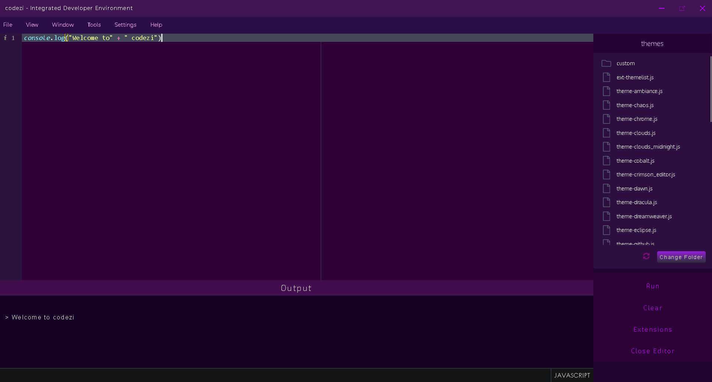
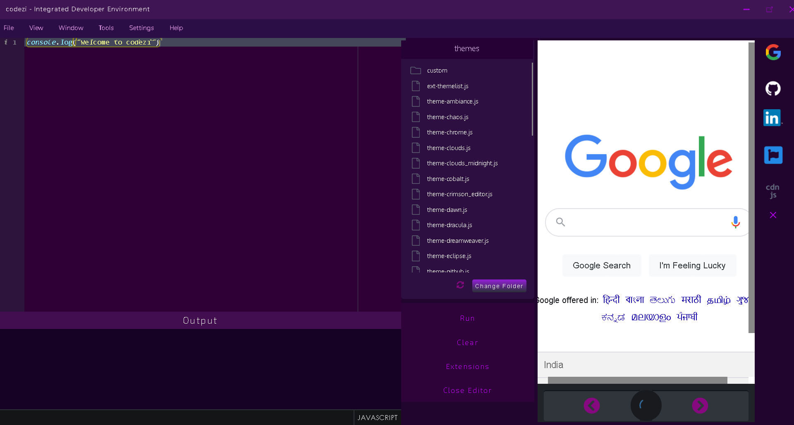
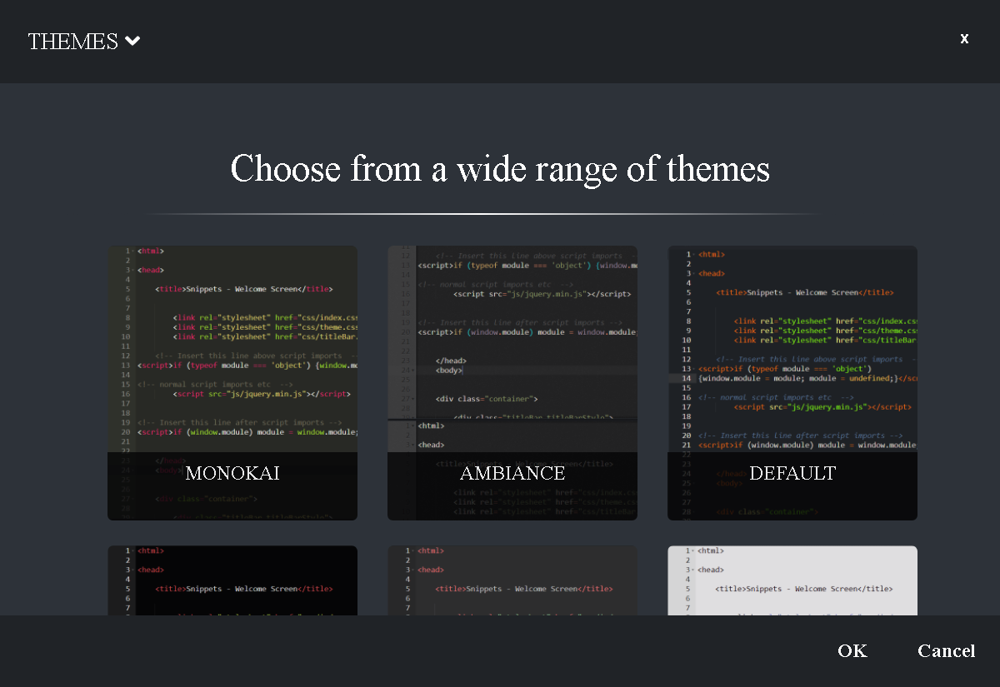

## <a href="https://github.com/pratyushshivam/Code-Compilation-Software">View Codezi Web IDE </a>

# Codezi-IDE for Windows
Codezi is a free source-code editor for Windows. Features include support for  debugging, syntax highlighting, highlighting folders and files, embedded output window, in frame pre-added websites and easy shortcuts.

 
 

## Easily accessible files list on the right and the output component at the bottom. Shortcuts for creating a new file, saving a file, closing the window and closing the output component available.

 

 
  

## Embedded frames for Google, Github, Stack Overflow and many more! 

 

 
 

## More than 30 themes available at a single click.

 

 

